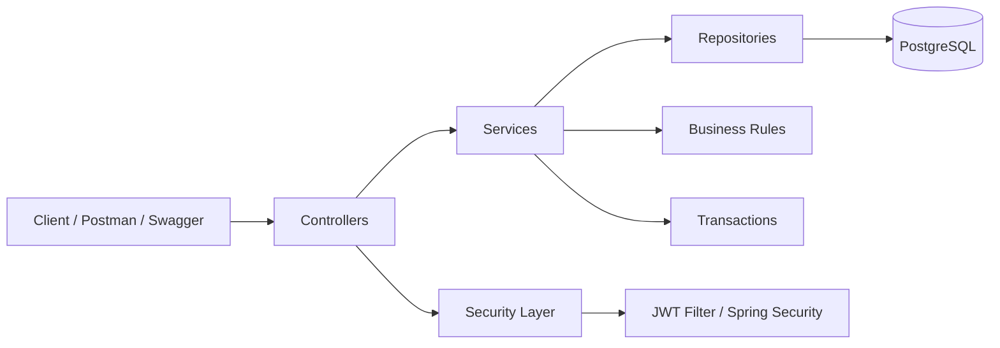

# 💰 Fintech API


[](https://github.com/farvic/fintech-api/actions/workflows/ci-java.yml)

---

## Sumário

- [1. Sobre o Projeto](#1-sobre-o-projeto)
- [2. Arquitetura](#2-arquitetura)
- [3. Modelagem de Domínio](#3-modelagem-de-domínio)
- [4. Segurança](#4-segurança)
- [5. Tecnologias](#5-tecnologias)
- [6. Como rodar](#6-como-rodar)
    - [6.1 Pré-requisitos](#61-pré-requisitos)
    - [6.2 Defina as variáveis de ambiente](#62-defina-as-variáveis-de-ambiente)
    - [6.3 Prepare o banco de dados](#63-prepare-o-banco-de-dados)
    - [6.4 Inicie a aplicação](#64-inicie-a-aplicação)
    - [6.5 Alternativa: rodar API sem Java local](#65-alternativa-rodar-api-sem-java-local)
    - [6.6 Acesse](#66-acesse)
    - [6.7 Postman](#67-postman)
    - [6.8 Parar e limpar ambiente Docker (opcional)](#68-parar-e-limpar-ambiente-docker-opcional)
- [7. Contato](#7-contato)

---

## 1. Sobre o Projeto

A fintech API simula operações financeiras básicas com autenticação, contas e transações.

O foco do projeto está em demonstrar:

- boas práticas de backend
- segurança com JWT
- modelagem de domínio realista
- testes automatizados

<p align="right"><a href="#sumário">Voltar ao topo</a></p>

---

## 2. Arquitetura

Arquitetura baseada em camadas:

- **Controller** → expõe endpoints REST
- **Service** → centraliza regras de negócio
- **Repository** → acesso a dados com JPA
- **Entity** → modelagem do domínio
- **DTO** → contratos de entrada e saída
- **Security** → autenticação/autorização via JWT

### 2.1 Diagrama



<p align="right"><a href="#sumário">Voltar ao topo</a></p>

---

## 3. Modelagem de Domínio

### 3.1 Transações

| Tipo | fromAccount | toAccount |
|---|---|---|
| DEPOSIT | null | conta |
| WITHDRAW | conta | null |
| TRANSFER | conta A | conta B |

Essa modelagem permite representar corretamente depósitos, saques e transferências usando a mesma entidade `Transaction`.

<p align="right"><a href="#sumário">Voltar ao topo</a></p>

---

## 4. Segurança

- autenticação via JWT
- Spring Security
- hash de senha com BCrypt
- endpoints protegidos com Bearer Token

### 4.1 Header esperado

```http
Authorization: Bearer <token>
```

<p align="right"><a href="#sumário">Voltar ao topo</a></p>

---

## 5. Tecnologias

- Java 17
- Spring Boot 4
- Spring Security
- JWT
- Spring Data JPA
- PostgreSQL
- Flyway
- Redis
- Swagger / OpenAPI
- JUnit + Mockito
- Postman

<p align="right"><a href="#sumário">Voltar ao topo</a></p>

---

## 6. Como rodar

Caso deseje rodar o projeto sem Java e PostgreSQL instalados localmente (apenas com Docker), após definir as variáveis de ambiente, pule para a sessão que ensina a [rodar API via container](#alternativa-rodar-api-sem-java-local).

### 6.1. Pré-requisitos

- Java 17
- PostgreSQL ou Docker


### 6.2. Defina as variáveis de ambiente

Edite o arquivo ```.env``` para refletir o usuário e senha do PostgreSQL, além da chave SECRET em base64 desejada. Valores de exemplo já estão configurados.

```env
POSTGRES_USERNAME=postgres
POSTGRES_PASSWORD=postgres
SECURITY_JWT_SECRET=ZmFrZS1zZWNyZXQtZm9yLWNpLXRlc3RzLTAxMjM0NTY3ODkwMTIzNDU2Nzg5MDE=
```

É possível gerar uma chave em base64 no site a seguir: [Random Base64 Generator](https://www.convertsimple.com/random-base64-generator/)

#### Windows (PowerShell)

```powershell
Copy-Item .env.example .env
```

#### Linux/MacOS

```bash
cp .env.example .env
```

### 6.3. Prepare o banco de dados

#### 6.3.1. Utilizando Docker

Na raiz do projeto:

```bash
docker compose up -d
```

#### 6.3.2. Utilizando o PostgreSQL

Substitua postgres_user e postgres_password pelo seu usuário e senha do postgres, respectivamente.

```
psql -U postgres_user -d postgres_password -c "CREATE DATABASE fintech;"
```

### 6.4. Inicie a aplicação

#### Windows

```powershell
.\mvnw.cmd spring-boot:run
```

#### Linux/MacOS

```bash
./mvnw spring-boot:run
```


### 6.5. Alternativa: rodar API sem Java local

Caso opte por seguir esse caminho, não será necessário iniciar a aplicação utilizando Java.

1. Suba API + Postgres e Redis:

```bash
docker compose -f docker-compose-api.yml up -d --build
```


### 6.6. Acesse

- Swagger: [http://localhost:8080/swagger-ui.html](http://localhost:8080/swagger-ui.html)
- Health: [http://localhost:8080/actuator/health](http://localhost:8080/actuator/health)


### 6.7. Postman

Caso deseje testar a API utilizando o Postman, a coleção está disponível na raíz do projeto.


### 6.8. Parar e limpar ambiente Docker (opcional)

Compose padrão:

```bash
docker compose down -v
```

Compose com api:

```bash
docker compose -f docker-compose-api.yml down -v
```

<p align="right"><a href="#sumário">Voltar ao topo</a></p>

## 7. Contato

Caso tenha achado o projeto interessante e/ou deseje entrar em contato, só me enviar uma mensagem no LinkedIn!

Meu LinkedIn: [https://www.linkedin.com/in/victorfa/](https://www.linkedin.com/in/victorfa/)

<p align="right"><a href="#sumário">Voltar ao topo</a></p>